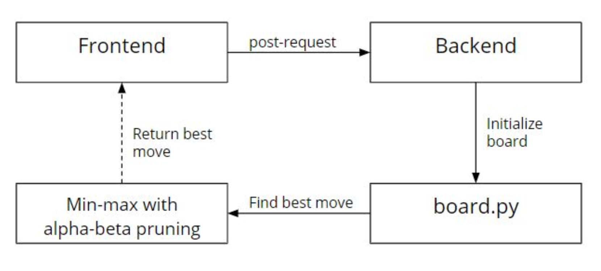
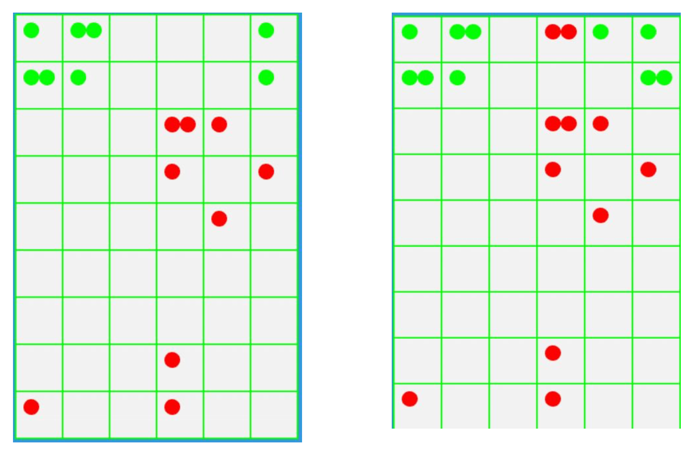

# Chain Reaction Game

## Description

* The gameplay takes place on an m×n board. The most commonly used size of the board is 9×6.
* For each cell on the board, we define a critical mass. The critical mass is equal to the number of orthogonally adjacent cells. That would be 4 for usual cells, 3 for cells in the edge, and 2 for cells in the corner.
* All cells are initially empty. The Red and the Green player take turns to place "orbs" of their corresponding colors. The Red player can only place a (red) orb in an empty cell or a cell that already contains one or more red orbs. When two or more orbs are placed in the same cell, they stack up.
* When a cell is loaded with a number of orbs equal to its critical mass, the stack immediately explodes. As a result of the explosion, to each of the orthogonally adjacent cells, an orb is added and the initial cell loses as many orbs as its critical mass. The explosions might result in overloading an adjacent cell and the chain reaction of explosion continues until every cell is stable.
* When a red cell explodes and there are green cells around, the green cells are converted to red and the other rules of explosions still follow. The same rule is applicable to other colors.
* The winner is the one who eliminates other player's orbs.

## Heuristic 
* Here we have used a simple heuristic:
    * Score = number of positive orbs(red) + number of negative
orbs(green)
    * If there are no positive orbs and the number of negative orbs is
    < -1, then the player with negative orbs wins and we return a
    maximum value of -200.
    * If there are no negative orbs and the number of positive orbs is >
1, then the player with positive orbs wins and we return a maximum value of 200.

## Implementation Flow


The game was developed in JavaScript using Phaser 3. The agent was developed in Python and an API was built in Flask to link the game with the agent.

## Getting Started

you can clone the code from repo "https://github.com/KeyurPatel2312/chain-reaction-game"

run the file main.py as ``` python3 main.py``` and game board will be open.

### Prerequisites

python3 : ``` sudo apt-get install python3```
 
python3-flask : ``` pip3 install flask```

### Demo Image of the game


## **Enjoy playing**!!


